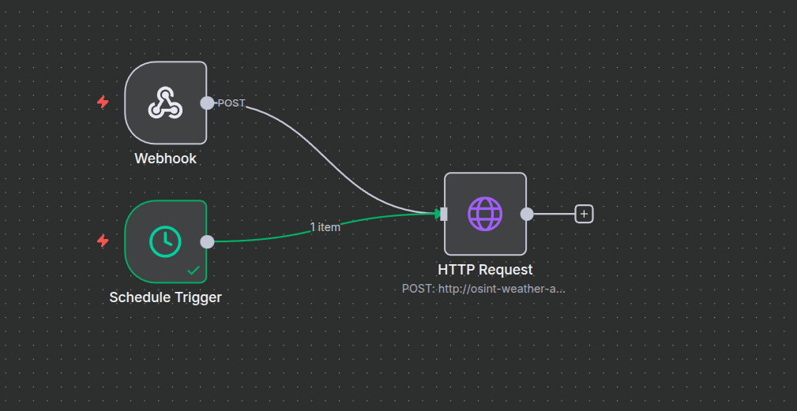

# osint-weather-aggregator

PROJECT GOAL: Build a microservice that: Fetches weather data for one city, collects brand mentions from public sources (OSINT), uses Gemini 1.5 Flash to generate sentiment + news summaries, stores everything in a database, exposes data through FastAPI endpoints, and runs automatically once per day.

## Quick Setup

**Prerequisites:** Docker and Docker Compose installed

1. Clone the repository
2. Run the setup script:
   ```bash
   ./setup.sh
   ```
3. Configure your `.env` file with required API keys:
   - `GEMINI_API_KEY` - Get from https://ai.google.dev/
   - `N8N_ENCRYPTION_KEY` - Generate with: `openssl rand -base64 24`
   - `N8N_POSTGRES_PASSWORD` - Any secure password
4. Run setup again:
   ```bash
   ./setup.sh
   ```

That's it! Your services will be running at:
- FastAPI: http://localhost:8000
- API Docs: http://localhost:8000/docs
- n8n: http://localhost:5678
- pgAdmin: http://localhost:5051

## Gemini AI Prompts

### Sentiment Analysis Prompt
```
Analyze the following brand-related text snippets and
provide a concise 1 or 2 sentence summary of the
overall public sentiment.
Be direct and avoid exaggeration.
Base your answer strictly on the text provided.
Text:

{osint_snippets}
```

### Trend Analysis Prompt
```
Summarize the major news or emerging trends about this brand
in 1 or 2 sentences based strictly on the text below. Keep
the tone neutral and avoid adding assumptions.

Text:
{osint_snippets}
```

**Model Used:** `gemini-2.5-flash`

**Input Format:** OSINT text snippets are formatted as:
```
Post 1:
Title: {post_title}
Text: {post_text}

Post 2:
Title: {post_title}
Text: {post_text}
...
```

## OSINT Sources

### Reddit
**API Endpoint:** Reddit Search API (`/r/all/search.json`)

**Data Collected:**
- Post titles
- Post selftext/body content

**Configuration** (via environment variables):
- `REDDIT_SEARCH_QUERY` - Search query (default: "gymshark")
- `REDDIT_SEARCH_LIMIT` - Number of posts to fetch (default: 10)
- `REDDIT_SEARCH_SORT` - Sort order: "new", "hot", "top", "relevance" (default: "new")

**Why Reddit:**
- Public API with no authentication required for read-only access

## API Examples

### Refresh Data (POST /api/v1/data/refresh)

Triggers the full data aggregation pipeline: fetches weather, OSINT data, runs Gemini analysis, and stores results.

**Request:**
```bash
curl -X POST http://localhost:8000/api/v1/data/refresh
```

**Response:**
```json
{
  "timestamp": "2025-11-23T01:24:09.725418",
  "sources": {
    "weather": {
      "status": "success",
      "records": 1,
      "data": [{
        "source": "open-meteo",
        "city": "Tel Aviv Yafo",
        "temperature_c": 24.5,
        "weather_description": "Clear sky"
      }]
    },
    "osint": {
      "status": "success",
      "records": 2,
      "data": {
        "brand_name": "Gymshark",
        "posts": [
          {
            "title": "Quick 2-minute..",
            "text": "Hey everyone — I'm doing a short survey..."
          },
          {
            "title": "Onyx V5 Singlet",
            "text": "Ngl the singlet looks really cool..."
          }
        ]
      }
    },
    "gemini": {
      "status": "success",
      "sentiment_summary": "Public sentiment ....",
      "news_summary": "Gymshark i..."
    }
  },
  "success_count": 3,
  "error_count": 0,
  "duration_seconds": 17.32
}
```

### Get Latest Data (GET /api/v1/data/latest)

Retrieves the most recent aggregated data record from the database.

**Request:**
```bash
curl http://localhost:8000/api/v1/data/latest
```

**Response:**
```json
{
  "id": 2,
  "aggregation_timestamp_utc": "2025-11-23T01:24:27.060929",
  "city_name": "Tel Aviv Yafo",
  "current_temperature_c": 24.5,
  "brand_name": "Gymshark",
  "sentiment_summary": "Public sentiment for the brand is mixed,...",
  "news_summary": "Gymshark is actively ...",
  "popularity_score": null
}
```

### Health Check (GET /health)

Simple endpoint to verify the service is running.

**Request:**
```bash
curl http://localhost:8000/health
```

**Response:**
```json
{
  "status": "healthy"
}
```

## Daily Automation with n8n

OSINT Weather Aggregation Automation

This workflow provides a complete end-to-end automation pipeline for refreshing OSINT and weather data inside the microservice.

Overview

The workflow can be triggered in two ways:

Manually, through a Webhook Trigger

Automatically, through a Schedule Trigger (e.g., daily at midnight)

Both triggers flow into the same HTTP Request node, which contacts the backend aggregation endpoint.

Components
1. Webhook Trigger

Allows manual execution of the workflow.
Useful for testing or forcing a refresh on demand.

2. Schedule Trigger

Production configuration: daily at midnight

3. HTTP Request

This node sends a POST request into the backend container:

POST http://osint-weather-aggregator_app:8000/api/v1/data/refresh


This internal Docker hostname (osint-weather-aggregator_app) ensures n8n can reach the FastAPI microservice from inside the same Docker network.

The endpoint executes the full aggregation pipeline:

1. fetch weather data

2. collect OSINT mentions

3. run Gemini summarization

4. save the record to the database

## How the Automation Works

Either the Webhook Trigger or the Schedule Trigger activates the workflow.

-The trigger emits one item into the HTTP Request node.

-The HTTP Request calls the microservice endpoint.

-The backend performs the entire aggregation and returns the final JSON response.

-The workflow completes without any manual steps.

